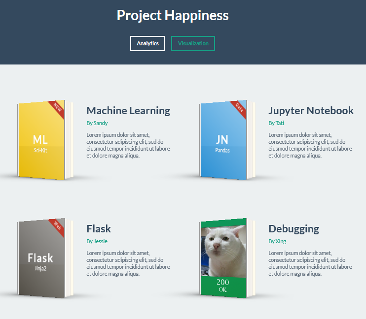
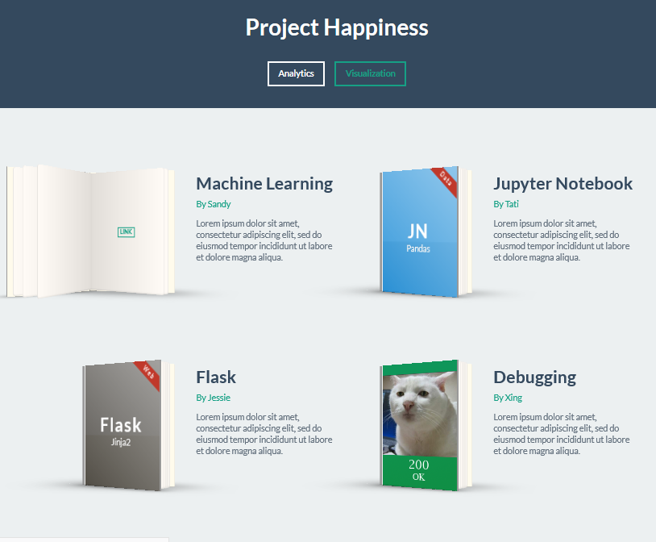

# Project Happiness

Github Page  
https://xliu510.github.io/Happiness/index.html

Heroku App  
https://world-happiness-inc.herokuapp.com/

## Project Description
1) Find factors that is related to happiness. 
2) Make interactive dashboard. 
3) Apply multivariable linear regression to model the relationships between the datasets and make happiness predictions.
4) Utilize training & testing technique for model fitting.

### Landing Page

