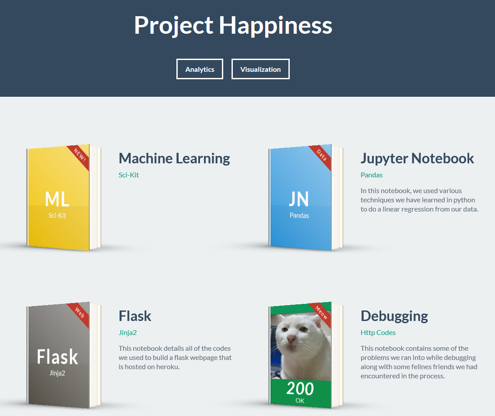
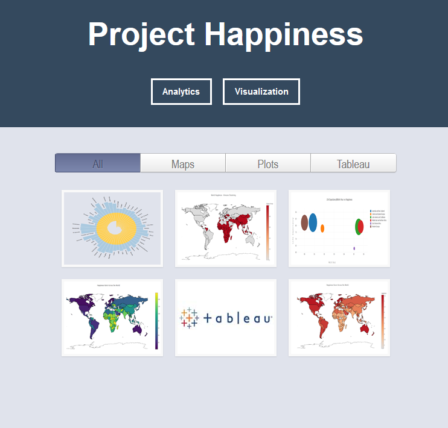
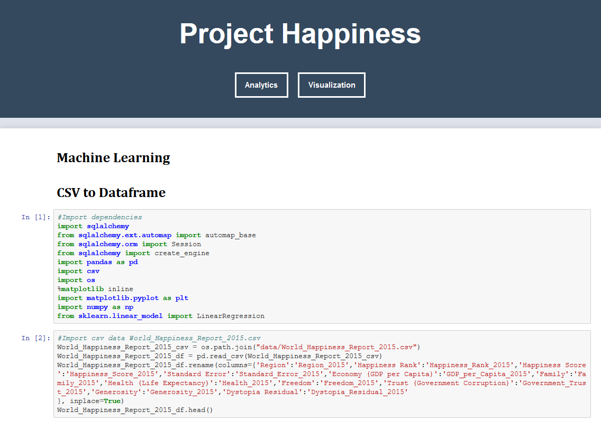
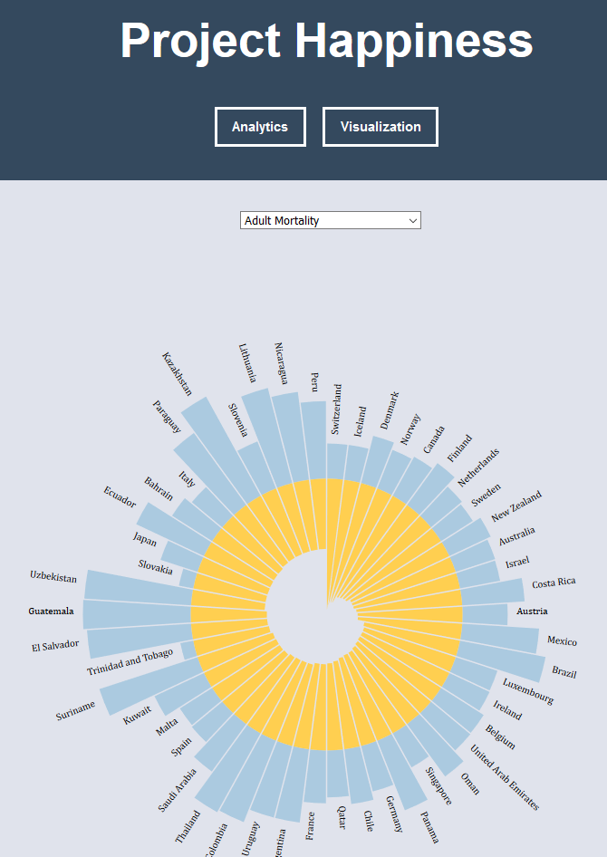
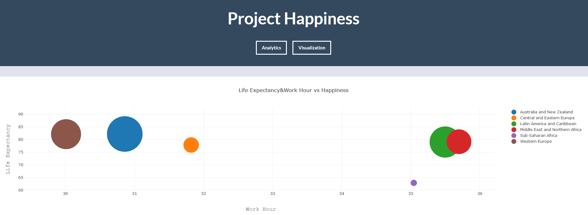
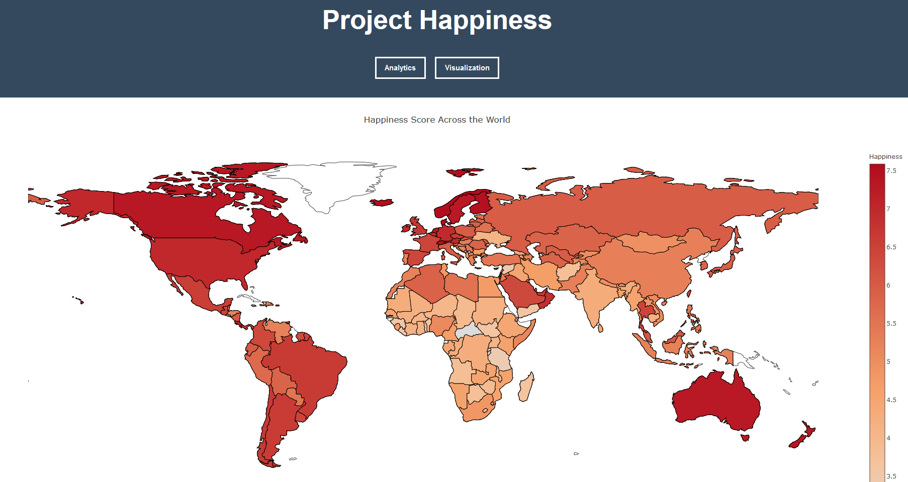

# Project Happiness  

#### Heroku App  
https://world-happiness-inc.herokuapp.com/  

## Project Description  
1) Find factors that is related to happiness.  
2) Make interactive dashboard.  
3) Apply multivariable linear regression to model the relationships between the datasets and make happiness predictions.  
4) Utilize training & testing technique for model fitting.
5) Use Machine Learning to Classify Happiness through Images.

### How to run  
open Import-export-clean-data.ipnyb in Jupyter notebook and run  
cd flask  
./run.sh  

### Landing Page  

### Visualization Page  

### JupyterNotebook Page  

### Radial Plot Page  

### Bubble Plot Page  

### Map Page 

